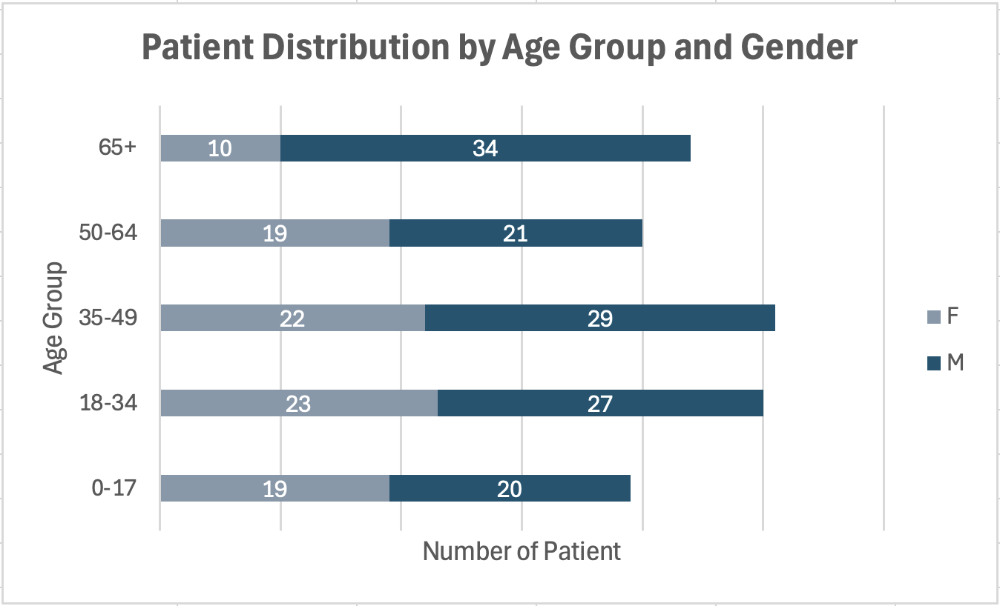

# Synthea Healthcare Analytics Portfolio (PostgreSQL)


------------------------------------------------------------------------------------------------
## 🎯 Project Overview

### The Business Problem
Healthcare payers and providers face increasing pressure to balance **cost containment** with **quality of care**. Identifying high-cost drivers, utilization patterns, and disease burden is essential for financial sustainability and population health management.

### My Solution
As a **Pharmacist-turned-Data Analyst**, I designed and implemented an **end-to-end healthcare analytics pipeline** using **PostgreSQL**. Synthetic EHR data generated by **Synthea** was transformed into an analytics-ready data mart to answer critical business and clinical questions related to cost concentration, utilization trends, and clinical risk profiles.

### 🚨 Key Insight: The *Alteplase* Anomaly
A Pareto analysis revealed a critical and non-intuitive finding:

- **76.93% of total medication spend is driven by a single drug: Alteplase (tPA)**
- Utilization volume is extremely low (<1% of patients)
- Costs are driven by **acute, catastrophic clinical events** rather than chronic disease maintenance

**Business Implication:**  
Financial risk in this population is highly volatile and dominated by rare, high-acuity events (e.g., stroke, embolism), requiring different cost-management strategies than routine chronic care optimization.

------------------------------------------------------------------------------------------------

## 👥 Intended Stakeholders

- Healthcare payers and insurance analytics teams  
- Hospital finance and quality improvement units  
- Pharmacy and formulary management teams  
- Healthcare data analysts and clinical informatics teams  

------------------------------------------------------------------------------------------------

## 📊 Visual Analysis Results

### 1. Patient Demographics



The patient population is relatively balanced across age groups and gender, with a notable representation of working-age adults and older patients.

### 2. Clinical Condition Distribution


Analysis of condition records shows that **Dental & Oral Health** and **Respiratory & ENT**
categories account for the largest share of documented diagnoses.


### 3. Pharmacy Cost Concentration 
*Identifying which therapeutic areas drive the highest spend.*


Pharmacy spending demonstrates a highly skewed distribution, where a **single acute-care
medication (Alteplase)** dominates total cost despite minimal utilization volume.

------------------------------------------------------------------------------------------------

## 🛠 Technical Approach & Skills

This project demonstrates **Full-Cycle Data Analytics**:

- **Raw Layer:** Ingested Synthea CSV outputs into a staging schema (`raw`)
- **Transformation:** Built an analytics layer (`mart`) with:
  - Typed columns (text → numeric/date)
  - Standardized clinical fields
  - Indexed patient and encounter keys
- **Data Quality:** Referential integrity checks confirmed zero orphan records

### 2. Data Modeling Strategy
- `mart.medications` grain: one row per medication order per patient encounter  
- Costs aggregated at the `medication_description` level for financial analysis  
- Patient-level joins enable polypharmacy and safety analysis  

### 3. Advanced SQL Analysis
- **Window Functions:** `SUM() OVER()` for Pareto and cumulative cost analysis  
- **Self-Joins:** Identification of clinical comorbidity patterns  
- **Data Cleaning:** Removal of administrative/non-clinical codes  
- **Clinical Categorization:** Rule-based grouping of SNOMED-derived condition descriptions to maintain interpretability and reproducibility  

### 4. Analytical Tools Used
- **SQL (PostgreSQL):** ingestion, transformation, cohort-level analysis  
- **Microsoft Excel:** data cleaning, exploratory analysis, and visualization  
- **pgAdmin 4:** query execution and inspection  

### 5. Tech Stack
- Database: PostgreSQL 15  
- Data Source: Synthea (synthetic EHR generator)  
- Environment: macOS (Terminal/Bash)  

------------------------------------------------------------------------------------------------
## 📂 Project Structure

```text
synthea_portfolio/
│
├── README.md               
│
├── data/                                  
│   └── raw/           
│
├── sql/                    
│   ├── 01_create_raw_tables.sql
│   └── 02_data_quality_checks.sql
│   └── 03_build_mart.sql
│   └── 04_analysis_queries.sql
│   └── 05_clinical_analysis_queries.sql
│   └── 06_pharmacy_specific_analysis.sql
│
├── output/  
│   ├── analysis/
│   │   └── excel/
│   │       ├── distribution_of_condition_records_by_clinical_category.xlsx
│   │       ├── high_utilizer_analysis.xlsx
│   │       ├── medication_cost_breakdown.xlsx
│   │       └── patient_demographic_distribution.xlsx
│   │               
│   ├── evidence/    
│   │   ├── clinical_comorbidity_risk.jpg
│   │   └── pharmacy_cost_saving_generic_substitution_top15.jpg
│   │ 
│   ├── evidence/   
│   │   └── extracts/
│   │       └── README.md
│   │       
│   └── visualization/ 
│       └── distribution_of_condition_records_by_clinical_category.jpg
│       └── high_cost_drivers_in_pharmacy_spending_USD.jpg 
│       └── patient_distribution_by_age_group_and_gender.jpg       
│
└── docs/                   
    └── clinical_insight.md

------------------------------------------------------------------------------------------------

## 🚀 How to Run This Project

Prerequisites
* PostgreSQL 15+
* pgAdmin 4 (or psql CLI)
* Java 8+ (to run Synthea)
* Synthea JAR (synthea-with-dependencies.jar)

### Step 1: Generate Synthetic Healthcare Data (Synthea)

bash

mkdir -p ~/projects/synthea_portfolio
cd ~/projects/synthea_portfolio

# Generate synthetic data for 200 patients
java -jar synthea-with-dependencies.jar -p 200

This will generate CSV files (patients, encounters, conditions, medications, etc.) inside the Synthea output directory.

### Step 2: PostgreSQL Database & Schema Setup

Create the database and shemas:

sql

CREATE DATABASE synthea_portfolio;

\c synthea_portfolio;

CREATE SCHEMA IF NOT EXISTS raw;
CREATE SCHEMA IF NOT EXISTS mart;

### Step 3: Creat Raw Tables

Run the following script in pgAdmin4 or psql:

sql

-- sql/01_create_raw_tables.sql

This script creates raw staging tables that mirror the structure of Synthea CSV outputs.

### Step 4: Load Raw Data (CSV Ingestion)

Load CSV files into the raw schema.

Recommended (Reproducible – SQL COPY):

sql

COPY raw.medications
FROM '/absolute/path/to/synthea/output/csv/medications.csv'
WITH (FORMAT csv, HEADER true);

Repeat for:
* patients
* encounters
* conditions
* medications

Note: Ensure PostgreSQL has read access to the CSV directory.

### Step 5: Data Quality Validation

Run data quality checks to validate ingestion completeness and key fields:

sql

-- sql/02_data_quality_checks.sql

This step ensures:
* No missing primary identifiers
* Critical clinical fields are populated
* Data is ready for transformation

### Step 6: Build Analytics Data Mart

Transform raw data into analytics-ready tables:

sql

-- sql/03_build_mart.sql

This step creates curated tables in the mart schema used for downstream analysis.

### Step 7: Analytical Queries & Insights

Run the analysis scripts in order, depending on the depth of analysis desired:

sql

-- sql/04_analysis_queries.sql
-- sql/05_clinical_analysis_queries.sql
-- sql/06_pharmacy_specific_analysis.sql

These queries generate:
* Patient demographic profiles
* Clinical comorbidity and risk patterns
* Cost distribution and Pareto analysis
* Medication adherence indicators
* Pharmacy cost-saving opportunities (e.g., generic substitution)

### Step 8: Outputs & Visualization

The results of the analysis are exported and visualized as .jpg files located in:
* output/evidence/
* output/visualization/

These outputs represent final analytical artefacts derived from the SQL queries.

------------------------------------------------------------------------------------------------
## ⚠️ Assumptions & Limitations

* Medication cost values in Synthea are synthetic and do not reflect real-world reimbursement
* Brand vs. generic status is not explicitly available; substitution analysis is simulated
* Generic substitution rate (70%) and cost reduction (80%) are payer-side assumptions used for demonstration
* Clinical appropriateness and formulary constraints are not modeled

------------------------------------------------------------------------------------------------

Author: Nur Fauziah - Pharmacist & Healthcare Data Analyst

------------------------------------------------------------------------------------------------

